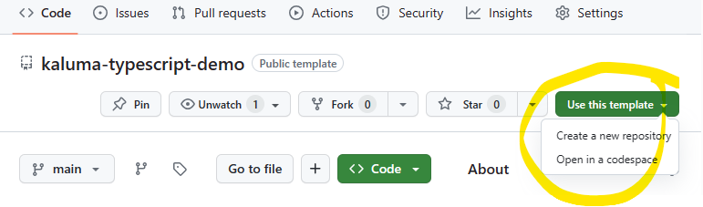

# Kaluma Typescript Demo

> [!NOTE]
> This demo utilizes the `@types\kaluma` definitions located in [DefinitelyTyped](https://github.com/DefinitelyTyped/DefinitelyTyped) repo. At the time of writing this readme, it is awaiting the initial checkin in [PR #67850](https://github.com/DefinitelyTyped/DefinitelyTyped/pull/67850). This demo will not be functional until that PR has been completed.

This repo demonstrates how to utilize [Typescript](https://www.typescriptlang.org/) and [Webpack](https://webpack.js.org/) for creating your [KalumaJS](https://kalumajs.org/) projects.

## Setup

**Step 1:** Make sure to follow the [installation steps](https://kalumajs.org/#installation) before attempting to create a typescript project. Once you've setup your Pico board with the Kaluma installation resume with below to build &amp; deploy your project.

**Step 2:** Install [Kaluma CLI](https://github.com/kaluma-project/kaluma-cli)

```bash
npm install -g @kaluma/cli
```

**Step 3:** Start your project by using this repository as a template. You'll find the "Use this template" button at the top of this page. Click this and "Create a new repository", clone it to your local machine, then run `npm install` to download all the necessary packages for building.



## Building your project

```bash
npm run build
```

This command will build your project to a minified bundle to `out/rp2.js`. This is also a sourcemap for future possibilities of debugging.

## Deploy your project

```bash
npm run flash
```

Building and deploying your project can be achieved by running the flash npm command. Make sure you have your Pico connected.